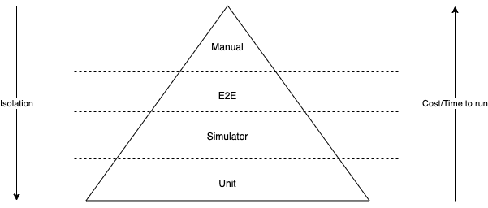
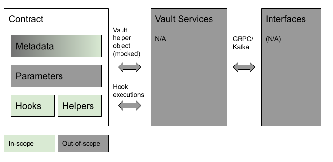
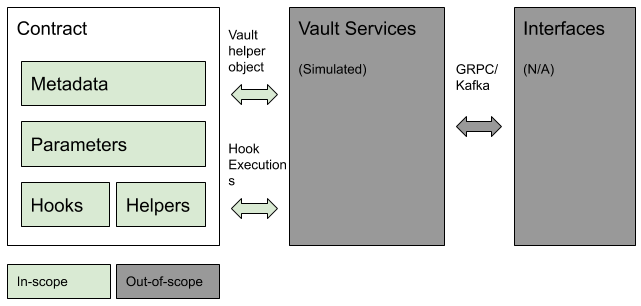
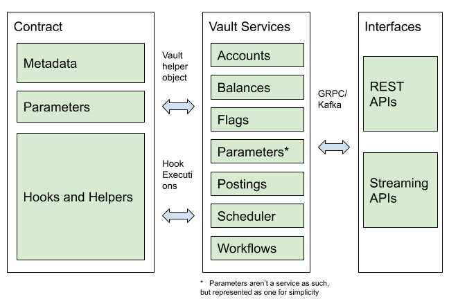

_© Thought Machine Group Limited 2021_

_All Rights Reserved. Confidential - Limited Distribution to Authorized Persons Only, Pursuant to the Terms of the Agreement between You and Thought Machine Group Limited granting you a licence for the software to which this documentation relates. This software is protected as an unpublished work and constitutes a trade secret of Thought Machine Group Limited, 5 New Street Square, London EC4A 3TW._

# Inception Test Framework Approach

## Testing Pyramid

The approach used in the Inception team is based on the well-known [testing pyramid](https://martinfowler.com/articles/practical-test-pyramid.html). This is typically unit, simulator, end-to-end (E2E) and manual tests as shown in the diagram below:



Ascending the pyramid results in a trade-off between decreasing isolation (thereby improving the realism of the test) and increasing the cost of running/writing the test. In other words, it is not practical to only write E2E tests or do manual testing. Instead, the coverage at the lower levels of the pyramid should provide confidence in the overall functionality, while the high levels should catch isolation-related issues (e.g. incorrectly mocked behaviours in unit tests, race conditions that are not encountered when aspects like timing are removed from consideration).

> **_NOTE:_**  Currently, Inception workflows are only tested using E2E and Manual tests. The Workflows API includes a WorkflowInstance Simulate endpoint (`/v1/workflow-instances:simulate POST`) to test the transforms and the different possible paths in a Workflow Definition. Future Inception Test Framework development may incorporate this test method.

## Test Isolation

### Isolating Contracts from One Another

Although the extent of isolation may vary between different levels of the testing pyramid, it is often desirable to isolate one contract from another regardless of the type of test. Isolating contracts from one another has many benefits:

- The contract being tested does not depend on the functionality of another contract.
- The tests are easier to write and understand.
- It provides more confidence that any test failure is due to a problem with the contract being tested and is not due to some external dependency.

For example, when testing a loan product that disperses the principal into a customer's current account, it is not advisable to create a current account for the disbursal of those funds. Instead, the funds should be disbursed into a dummy account.

To facilitate the isolation of contracts, the Inception Release package includes empty contracts which can be used to create dummy accounts. The empty contracts can be found at `inception_sdk/test_framework/contracts/empty_liability_contract.py` and `inception_sdk/test_framework/contracts/empty_asset_contract.py` and these paths are also available as constants in `inception_sdk/test_framework/contracts/files.py`. As indicated by the name, these do have a defined TSide, but either can be used if you do not care about this attribute.

To create a dummy account using this empty contract, add the empty contract to the `CONTRACTS` constant as shown below:

```python
endtoend.testhandle.CONTRACTS = {
    ...,
    "name_of_your_dummy_account": {"path": files.EMPTY_LIABILITY_CONTRACT}
}
```

You can then use `"name_of_your_dummy_account"` in your tests to refer to the dummy account.

For an example on using a dummy account to achieve contract isolation, see `library/loan/tests/e2e/test_loan.py`. In these tests, the loan product uses a dummy current account as the deposit account.

### Contract Isolation and Supervisors

Since the fundamental purpose of supervisors involves interacting with accounts from multiple products, it does not make sense to use dummy contracts when writing supervisor tests. Instead, supervisor tests should use accounts created from the products they supervise for testing (e.g. the Savings Sweep supervisor should use a US Checking and a US Savings account for testing).

Note that it is recommended for all tests related to the supervisor's functionality to be included as a part of the supervisor's tests and not in the tests of the individual products being supervised. For example, the US Checking and US Savings accounts should not contain any tests that utilize the Savings Sweeper supervisor.

See `library/savings_sweep/tests/e2e/test_savings_sweep.py` for examples of supervisor tests.

### Product and Workflow Functionalities

Contracts and workflows often work together to form product functionality. It is important to ensure that this functionality is tested, which includes testing the various workflow paths. However, this does not necessarily mean that workflows need to be used in every test to achieve the desired product functionality.

For example, consider a workflow that opens an account. It is not necessary to open accounts via this workflow in all of the tests. If all relevant paths of this workflow have been tested elsewhere (i.e. there are other test(s) that use the workflow to open an account), the core API can be used to open the account directly, which may help the test run faster.

For tests primarily focused on verifying workflow functionality, it might be a good idea to put the word "workflow" somewhere in the test name. This helps indicate that the test is workflow-specific.

### Unit Tests

#### Contracts



In Unit tests the focus is on testing individual Python functions as shown in the diagram. This is currently a mixture of tests for the contract hooks themselves, or the helper functions directly.

- The Vault helper object is mocked to provide isolation of the Vault services
- Metadata is only partially tested as it is not necessarily consumed within the contract hooks/helpers themselves. For example, supported denominations could only be used by the Accounts service when creating new accounts.
- Parameter definitions are not tested other than through syntax validation. As the parameter values come from the Vault helper object, which as mentioned is mocked, it is the responsibility of the test writer to ensure that these values are consistent with the definitions.

The [Vault documentation hub][1] provides an introduction to writing Unit tests and access to downloadable Python tester libraries. The Inception Release Package includes further tools including:

- `inception_sdk/vault/contracts/unit/types_extension.py` - provides a wrapper around the standard `types.py` provided by the Contracts SDK to add extra methods (e.g. a method for adding `Balances`), to access other data attributes of the Class object, or define custom `types`.

- `inception_sdk/test_framework/contracts/unit/common.py` - provides functions for running Unit tests, creating Mock Objects of commonly used objects such as the `Vault` object, `Balances`, `Posting Instructions`, `Posting Instruction Batches`, and then interacting with those objects.

- `inception_sdk/vault/contracts/unit/supervisor/` - similar files for testing Supervisor contracts

#### Workflows

The framework currently supports testing Workflows end-to-end. Support for the Workflow simulation endpoint may be added in the future.

### Simulator Tests

#### Contracts

Simulator tests focus on sequences of events that represent business scenarios, or more complex integration scenarios. They are used to test contracts in their entirety in response to realistic inputs, such as receiving postings or the execution of schedules. This is in contrast to Unit tests which only call individual hooks or helper methods. In order to test the contract in isolation from the rest of Vault Services, the simulation framework simulates their behaviour. The diagram below shows the wider scope of the Simulation tests.



- `Events` are used to reproduce ad-hoc contract executions (e.g. a posting is received) and updates to relevant data (e.g. updating parameters or applying flags) that would normally happen via Vault interfaces (e.g. REST API requests, postings received via the Streaming API).
- Amongst a range of Vault services:
  - The postings and balances services are simulated so that posting instruction directives result in updated postings and balances when retrieved in subsequent hook executions.
  - The scheduler is simulated so that the contract scheduled code is executed at the required times.
- No real, durable resources (accounts, postings, balances, schedules etc.) are created in the environment and hence neither REST nor Streaming API integrations can be tested.

- The simulator does not attempt to simulate contract or service processing time which can mask race conditions in contracts. All contract and simulated service processing effectively takes 0s.

### End-to-End (E2E) Tests

In E2E tests there is little or no isolation. Both Contract and Workflow testing occurs by interacting directly with the regular Vault REST or Kafka APIs. All the services and interfaces are exposed. The only exception is the User Interface (UI), which is not covered as workflow inputs are provided via REST API rather than via Vault-Apps. Manual testing removes this final layer of isolation. This wider scope of E2E Tests is shown in the diagram below:



[1]: http://<documentation_hub_address>/reference/contracts/development_and_testing/
